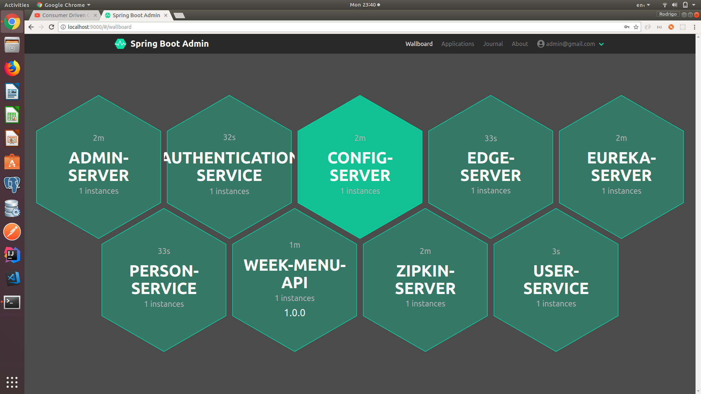
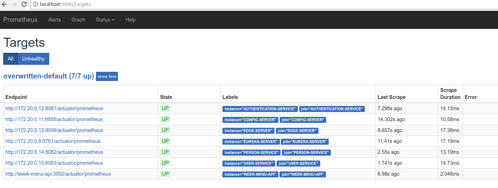
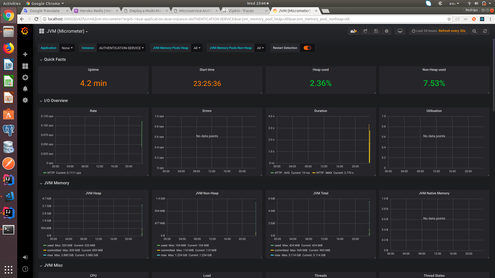
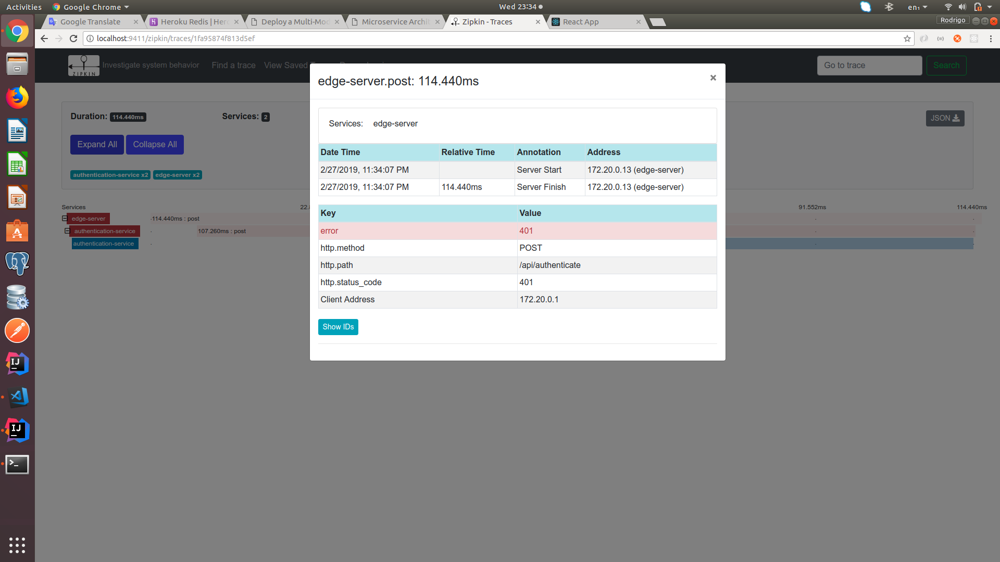
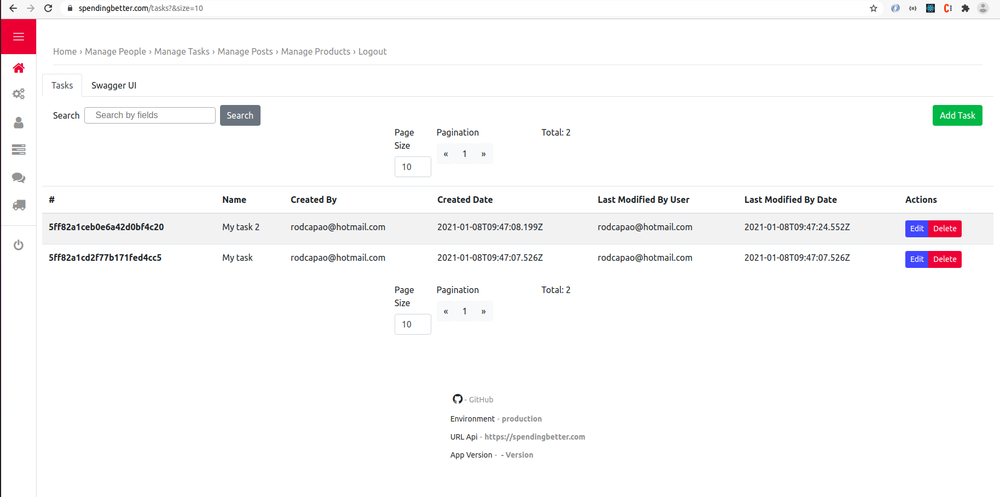

# Microservice Architecture with Multiple Languages

The main idea of this project is how to apply `Microservice Architecture by Chris Richardson` in multiple languages.

Most all services are made in `Java with Spring Boot 2 + Webflux(Reactive Programming) + MongoDB` but there is one in `NodeJS` and web app using `React`. 

This pattern could be applied for any language.

Inspired from the book [Microservices Patterns](https://www.manning.com/books/microservices-patterns) by `Chris Richardson - @crichardson`.

## Contents

  1. [Microservice Patterns](#microservice-patterns)
  2. [Prerequisites](#prerequisites)
  3. [Microservice Diagram](#microservice-diagram)
  4. [Installing all services using Docker Compose](#installing-all-services-using-docker-compose)
  5. [Docker Commands](#docker-commands)
  6. [Monitoring - Spring Boot Admin](#monitoring---spring-boot-admin)
  7. [Service Discovery - Eureka](#service-discovery---eureka)
  8. [Externalized Configuration - Spring Config](#externalized-configuration---spring-cloud-config)
  9. [Prometheus and Grafana](#prometheus-and-grafana)
  10. [Zipkin Request Tracing](#request-tracing-zipkin)
  11. [Manual Installation - NOT RECOMMENDED](#manual-installation---not-recommended)
  12. [Accessing React Web App](#accessing-react-app)
  13. [List of default users](#default-users)
  14. [Kubernetes - Google Cloud Platform](#kubernetes---google-cloud-platform)
  15. [TODO-LIST](#todo-list)
  16. [References](#references)
  17. [Postman Collection](docs/postman_collection.json?raw=true)

### Microservice Patterns

It is implemented so far the following list of patterns:

 * **Server-side service discovery** - Used [Spring Cloud Eureka Server](https://cloud.spring.io/spring-cloud-netflix/multi/multi_spring-cloud-eureka-server.html) on `eureka-server` folder, Added `<artifactId>eureka-consul-adapter</artifactId>` for `scraping data for Prometheus`
 
 * **Client-side service discovery** - Used [Spring Cloud Eureka Client][https://cloud.spring.io/spring-cloud-netflix/multi/multi__service_discovery_eureka_clients.html] and all microservices(`admin-server, user-service, person-service, etc`) are running as a client service discovery
 
 * **API Gateway** - Used [Spring Cloud Zuul](https://cloud.spring.io/spring-cloud-netflix/multi/multi__router_and_filter_zuul.html) on `edge-server` folder
 
 * **Externalized configuration** - Used [Spring Cloud Config Server](https://cloud.spring.io/spring-cloud-config/multi/multi__spring_cloud_config_server.html) on `config-server` folder, all yml files are on `configuration` folder 
 
 * **Exception Tracking** - Used [Spring Boot Admin](https://codecentric.github.io/spring-boot-admin/current/) on `admin-server` folder
 
 * **Access token** - [JSON Web Token](https://jwt.io) for `Authentication/Authorization` on services(`user-service, person-service, authentication-service, nodejs-service`)
 
 * **Health Check API** - All `Java microservices` are using [Spring Boot Actuator Starter](https://docs.spring.io/spring-boot/docs/current/reference/htmlsingle/#production-ready) - `<artifactId>spring-boot-starter-actuator</artifactId>` and NodeJS is using `express-actuator`
 
 * **Distributed tracing** - All `Java microservices` are using [Spring Cloud Sleuth](https://spring.io/projects/spring-cloud-sleuth) `<artifactId>spring-cloud-starter-sleuth</artifactId>`, Zipkin `<artifactId>spring-cloud-starter-zipkin</artifactId>` and NodeJS is using `morgan, zipkin, zipkin-transport-http and zipkin-context-cls`
 
 * **Application metrics** - All `Java microservices` are using [Spring Micrometer Prometheus](https://spring.io/blog/2018/03/16/micrometer-spring-boot-2-s-new-application-metrics-collector) - `<artifactId>micrometer-registry-prometheus</artifactId>` and NodeJS is using `express-prom-bundle`
 
 * **Database per service** - All services are using `MongoDB` as a separately database
 
 * **Shared database** - `Redis` is used for sharing database session for services `Eureka Server, Config Server, Edge Server and Spring Boot`, login depends on users registered on `MongoDB` database

To know more about each pattern find at [Microservice Architecture](https://microservices.io/patterns/microservices.html)

### Prerequisites
 * JDK 1.8
 * Maven 3
 * Docker 17.05.0-ce+ - `Not necessary but recommended otherwise the services should run by command`
 * Docker Compose 1.23.2 - `Not necessary but recommended otherwise the services should run by command`

### Microservice Diagram
 
 

### Installing All Services using Docker Compose

The easiest way to run all microservices is using `docker-compose`, run the following commands:

On `root folder` first need to generate the docker images.

```bash
# at once for building the docker images
mvn clean install docker:build
```

Then on `docker folder` run all microservices using

```bash
docker-compose up -d
```

PS: Whenever change is made on the source code it is necessary to rebuild the image, you can use the following command:

```bash
docker-compose up --build week-menu-api react-webapp
```

### Docker Commands

To see logs for a specific docker container:

```bash
docker logs -f SERVICE_NAME
```

PS: Service names are on `docker-compose.yml -> container_name`

To execute a command inside the container:

```bash
docker exec -it week-menu-api sh
```

To stop and remove all containers:
```bash
docker-compose down -v
```

To restart/start/stop/remove specific container:

```bash
docker-compose restart SERVICE_NAME
docker-compose up SERVICE_NAME
docker-compose stop SERVICE_NAME
docker-compose rm SERVICE_NAME
```

### Monitoring - Spring Boot Admin

To see information(environment, instances, logs, etc) related to `all microservices registered with Eureka` use [Spring Boot Admin](http://localhost:9000) - `http://localhost:9000`.



PS: Need login with a valid user and role `ADMIN`. See at [Default Users](#default-users)

### Service Discovery - Eureka

To see `all microservices registered with Eureka` use http://localhost:8761.


PS: Need login with a valid user and role `ADMIN`. See at [Default Users](#default-users)

### Externalized Configuration - Spring Cloud Config

To see configuration related to specific service use [Spring Config](http://localhost:8888/edge-server/default) `http://localhost:8888/${SERVICE_NAME}/${SPRING_PROFILE}`.


PS: Need login with a valid user and role `ADMIN`. See at [Default Users](#default-users)

### Prometheus and Grafana

`Prometheus` is a tool for generating metrics from the requests.

`Grafana` is a tool for communicate with `Prometheus` and display the data with dashboards.

Spring Boot 2 by default uses [Micrometer](https://micrometer.io) for monitoring `JVM/Microservices Applications`.

To access [Prometheus UI](http://localhost:9090)

 
 
To access [Grafana Dashboard](http://localhost:3000).



PS: It depends on docker.

### Sleuth and Zipkin

`Sleuth` is used for creating a unique identifier(Span) and set to a request for all `microservices calls`.

`Zipkin` is used for request tracing through `microservices`.

To access [Zipkin UI](http://localhost:9411).




### Manual Installation - NOT RECOMMENDED

If for some reason you cannot install `docker/docker-compose` you can run all services manually.

On `root folder` run the following command at once:

`mvn clean install`

**Run Spring Boot**

To run the services use the following command in each `Microservices folders`:

`mvn spring-boot:run -Dspring-boot.run.arguments="--server.port={PORT}"`

```
eureka-server - PORT=8761
config-server - PORT=8888
edge-server - PORT=9006
admin-server - PORT=9000
authentication-service - PORT=8081
person-service - PORT=8082
user-service - PORT=8083
```

PS: To login at `Eureka/Config/Edge/Admin` need a user with role `ADMIN`. See at [Default Users](#default-users)

**Run Node.js service**

On `nodejs-service folder` run the following commands:

```
sudo npm install

sudo npm start
```

**Run React Web app**

On `react-webapp folder` run the following commands:

```
sudo npm install

sudo npm start
```

### Accessing React App

To access [React Web App](http://localhost:3001).




### Default Users

Following the list of default users:

```
admin@gmail.com/password - ROLE_ADMIN

master@gmail.com/password123 - ROLE_PERSON_CREATE, ROLE_PERSON_READ, ROLE_PERSON_SAVE

anonymous@gmail.com/test - ROLE_PERSON_READ
```

### Kubernetes - Google Cloud Platform

The code is deployed at `Google Cloud Platform`, to access it go through `https://spendingbetter.com`.

Following useful commands for kubernetes

```
cd kubernetes

#Deploy
kubectl apply -f deployment-admin-server.yml

#Undeploy
kubectl delete -f deployment-admin-server.yml

#see logs
kubectl logs admin-server-RAND-ID -f

#exec command
kubectl exec -it redis-5b4699dd74-qckm9 -- sh

#show all pods
kubectl get pods --show-labels

#ingress
kubectl get ing
kubectl describe ingress
```

[Enable Ingress](https://cloud.google.com/community/tutorials/nginx-ingress-gke)
[Example Ingress Configuration](https://github.com/GoogleCloudPlatform/community/blob/master/tutorials/nginx-ingress-gke/ingress-resource.yaml)
[Install Helm](https://helm.sh/docs/using_helm/#installing-helm)
[Kubernetes + Zuul](https://stackoverflow.com/questions/52066141/zuul-unable-to-route-traffic-to-service-on-kubernetes)
[Example Spring Boot 2 + Kubernestes + Zuul](https://piotrminkowski.wordpress.com/2018/08/02/quick-guide-to-microservices-with-kubernetes-spring-boot-2-0-and-docker/)
https://piotrminkowski.wordpress.com/2018/05/21/secure-discovery-with-spring-cloud-netflix-eureka/

### Swagger UI

Swagger UI is available for `Authentication, Person and User Services`

Access it [Swagger UI](http://localhost:{SERVICE_PORT}/swagger-ui.html) - `http://localhost:{SERVICE_PORT}/swagger-ui.html`

### TODO List

* [X] Java - Split Person and User in different entities
* [X] Java - Split back-end and front-end in two different folders
* [X] Java - Split Java 8 Learning in another folder
* [ ] ~~Java - Add Cloud Foundry for deploy~~
* [ ] Java - Add Heroku for deploy
* [X] Java - Add Test for Users Classes
* [X] Java - Add Spring Cloud Config
* [X] Java - Add Service Discovery(Eureka)
* [X] Java - Add Zuul(Gateway)
* [X] Java - Add Maven Docker Plugin
* [X] Java - Add Redis for Shared Session between applications
* [X] Java - Add Authentication for all applications
* [X] Java - Add Prometheus/Grafana for docker compose
* [X] Java - Fix Zuul/Edge Server for working with NodeJS Service
* [ ] Kotlin - Add Service using Kotlin Language
* [ ] Scala - Add Service using Scala Language
* [ ] C# - Add Service using C# Language
* [ ] Kubernetes/Minikube - Add example to use Kubernetes with Minikube
* [X] React - Create User List
* [ ] React - Create User Page
* [ ] React - Create User Edit
* [ ] React - Create Categories Edit
* [ ] React - Create Recipes Edit
* [ ] React - Fix User Create/Edit
* [ ] React - Fix Person Create/Edit
* [ ] React - Fix Person List to work with `@Tailable` and `EventSource`.
* [X] React - Fix Docker to use Nginx

### References
[Pattern Microservice Architecture](https://microservices.io/patterns/microservices.html)

[Spring Guide](https://spring.io/guides)

[Spring Boot](https://start.spring.io)

[React ad Spring WebFlux](https://developer.okta.com/blog/2018/09/25/spring-webflux-websockets-react)

[Spring WebFlux Security Jwt](https://github.com/raphaelDL/spring-webflux-security-jwt)

[Junit 5](https://medium.com/@GalletVictor/migration-from-junit-4-to-junit-5-d8fe38644abe)
